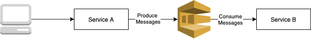

# AWS SQS (Java)



The project source includes function code and supporting resources:
- `src/main` - A Java function.
- `template-cf.yml` - An AWS CloudFormation template that creates an application.
- `pom.xml` - A Maven build file.
- `aws-scripts/create-queue.sh`, `aws-scripts/describe.sh`, etc. - Shell scripts that use the AWS CLI to deploy and manage the application.

Use the following instructions to deploy the sample application.

# Requirements
- Java 8
- Maven 3
- The Bash shell. 
- AWS CLI V2

If you use the AWS CLI v2, add the following to your [configuration file](https://docs.aws.amazon.com/cli/latest/userguide/cli-configure-files.html) (`~/.aws/config`):

```
cli_binary_format=raw-in-base64-out
```

This setting enables the AWS CLI v2 to load JSON events from a file, matching the v1 behavior.

## Create Queue (SQS) using cloudformation stack
This script uses AWS CloudFormation to create the new SQS and an CloudWatch alarms. If the AWS CloudFormation stack that contains the resources already exists, the script updates it with any changes to the template or function code.  

To create a SQS for application to enqueue and dequeue, run `create-queue.sh`.

    $sh ../create-queue.sh
    Waiting for changeset to be created..
    Waiting for stack create/update to complete
    Successfully created/updated stack - aws-sqs

## Describe stack
To describe, run `describe.sh`.

    $ sh ../describe.sh
    {
        "Stacks": [
            {
                "StackId": "arn:aws:cloudformation:eu-west-1:035864429412:stack/aws-sqs/4e0f12f0-9d74-11eb-936f-026c3755f36f",
                "DriftInformation": {
                    "StackDriftStatus": "NOT_CHECKED"
                },
                "Description": "This example template shows how to create an Amazon SQS queue with CloudWatch alarms on queue depth. This template creates an Amazon SQS queue and one or more CloudWatch alarms. You will be billed for the AWS resources used if you create a stack using this template.",
                "Tags": [],
                "Outputs": [
                    {
                        "Description": "ARN of new AmazonSQS Queue",
                        "OutputKey": "QueueARN",
                        "OutputValue": "arn:aws:sqs:eu-west-1:035864429412:first-topic"
                    },
                    {
                        "Description": "Name of new Amazon SQS Queue",
                        "OutputKey": "QueueName",
                        "OutputValue": "first-topic"
                    },
                    {
                        "Description": "URL of new Amazon SQS Queue",
                        "OutputKey": "QueueURL",
                        "OutputValue": "https://sqs.eu-west-1.amazonaws.com/035864429412/first-topic"
                    }
                ],
                "EnableTerminationProtection": false,
                "CreationTime": "2021-04-14T22:54:01.731Z",
                "Capabilities": [
                    "CAPABILITY_NAMED_IAM"
                ],
                "StackName": "aws-sqs",
                "NotificationARNs": [],
                "StackStatus": "CREATE_COMPLETE",
                "DisableRollback": false,
                "RollbackConfiguration": {},
                "ChangeSetId": "arn:aws:cloudformation:eu-west-1:035864429412:changeSet/awscli-cloudformation-package-deploy-1618440841/8b09ed3d-03d9-41e1-8486-065b88fa3c1d",
                "LastUpdatedTime": "2021-04-14T22:54:07.017Z"
            }
        ]
    }
    

## Package the app

    $ ./mvnw package
    

## Run the app

    $ java -jar target/aws-sqs-0.0.1-SNAPSHOT.jar

## Test 
### Request
To invoke the service, run the URL - `http://localhost:8080/api/produceMessage/Hello`

### Response
In logs you will see the logs as below:

    2021-04-14 23:46:00.671  INFO 34950 --- [nio-8080-exec-1] c.aws.sqs.controller.ProducerController  : Received Message Hello
    2021-04-14 23:46:00.673  INFO 34950 --- [nio-8080-exec-1] c.a.s.c.a.s.s.MessageSenderService       :  Messgae Hello 
    2021-04-14 23:46:00.673  INFO 34950 --- [nio-8080-exec-1] c.a.s.c.a.s.s.MessageSenderService       :  Queue name first-topic 
    2021-04-14 23:46:01.418  INFO 34950 --- [SQSExecutor - 2] c.a.s.c.a.s.s.ConsumerListenerService    : Received new SQS message: Hello


## Delete the stack
To clean/delete the resources created, run `cleanup.sh`

    $ sh ../cleanup.sh        


